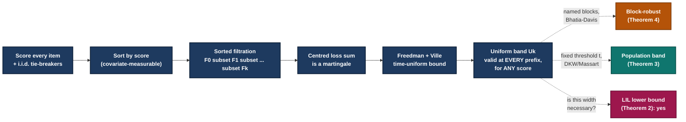

<h1 align="center">The Iterated-Logarithm Price of Post-Hoc Threshold Selection</h1>

<p align="center">
  <em>Anonymous code release &middot; ICLR 2027 submission &middot; under double-blind review</em>
</p>

<p align="center">
  <a href="#installation"></a>
  <a href="LICENSE"></a>
  <a href="#reproducing-the-paper"></a>
  <a href="#tests"></a>
  <a href="https://github.com/PyTorch/pytorch"></a>
  <a href="#status"></a>
</p>

<p align="center">
  <a href="#tldr">TL;DR</a> &bull;
  <a href="#the-core-idea-in-one-diagram">Core idea</a> &bull;
  <a href="#how-this-compares">Comparison</a> &bull;
  <a href="#installation">Installation</a> &bull;
  <a href="#quickstart">Quickstart</a> &bull;
  <a href="#repository-structure">Structure</a> &bull;
  <a href="#theory-to-code-crosswalk">Crosswalk</a> &bull;
  <a href="#reproducing-the-paper">Reproducing</a> &bull;
  <a href="#results-at-a-glance">Results</a> &bull;
  <a href="#citation">Citation</a>
</p>

---

> **Note on anonymity.** This repository accompanies a paper currently under double-blind
> review. All author-identifying information has been removed from code, comments, commit
> metadata guidance, and configuration files. See [`ANONYMITY.md`](ANONYMITY.md) for the
> checklist we followed and for instructions if you are hosting this on a mirror such as
> [Anonymous GitHub](https://anonymous.4open.science).

## TL;DR

Selective prediction systems are deployed by picking a confidence threshold *after* looking
at a calibration curve — but every standard risk certificate (Clopper&ndash;Pearson, Hoeffding,
empirical Bernstein, betting/WSR bounds, Learn-then-Test) is only valid at a threshold fixed
**before** the data are seen. This repository implements a certificate that *is* valid under
post-hoc selection:

1. **A uniform risk&ndash;coverage band** (`src/bands/uniform_band.py`) that covers the realized
   risk of every prefix of a score-sorted sequence simultaneously, for an arbitrary score,
   built from a time-uniform (anytime-valid) concentration argument over the *sorted filtration*.
2. **A matching lower bound**: the band's $\sqrt{\ln\ln k / k}$ width is not slack — any
   band valid at every prefix simultaneously must pay this rate infinitely often
   (`src/bands/lil_lower_bound.py`, with an empirical falsification harness in `scripts/run_necessity_sweep.py`).
3. **A block-robust extension** that survives arbitrary within-block dependence once the
   analyst commits to a block structure in advance, at no extra width penalty
   (`src/bands/block_robust.py`).
4. **A population-level, threshold-indexed band** for deployment, with an explicit
   feasibility condition telling you when a target risk level is reachable at all, and a
   two-sided certificate that reports risk and coverage together at no extra cost
   (`src/bands/population_band.py`).
5. A from-scratch, from-first-principles re-implementation of every baseline certificate used
   for comparison (`src/baselines/`), including the one-line patch to the betting/WSR bound
   described in the paper (`src/baselines/wsr_betting.py`) — a real defect we found in our
   *own* implementation, not the officially released one, and diagnosed down to a single line.

Everything in `src/` is a direct, literal implementation of the theorem statements in the
paper — every function docstring cites the exact theorem, corollary, or equation number it
implements, so the code can be checked line-by-line against the PDF. Where the paper is
honest that a result is *empirically verified but not formally proven* (Remark 1's closed
form), the code says so too, in the same words.

## The core idea, in one diagram

The entire theoretical contribution collapses to one observation: sorting by a confidence
score is measurable in the covariates alone, so it doesn't disturb the conditional
independence of the losses. That turns the risk&ndash;coverage curve into a martingale, and
martingales have anytime-valid concentration for free.



Nothing in this pipeline is new machinery — Freedman's construction, Ville's inequality,
DKW, and Bhatia&ndash;Davis are all classical. The contribution is recognizing that
*coverage itself* can play the role that "time" usually plays in anytime-valid inference,
once you condition on the sort.

## How this compares

|                     Certificate | Valid under post-hoc selection?                         | What it costs                                       |
|---------------------------------:|:---------------------------------------------------------|:-----------------------------------------------------|
|                Clopper&ndash;Pearson | ❌ 12.7% overrun ($r_1$, this study's scale)                | &mdash;                                               |
|                     Betting / WSR | ❌ 11.6&ndash;29.5% overrun (raw, all rules)                    | &mdash;                                               |
|                         Hoeffding | ✅ *at this study's scale* &mdash; not by design               | Excess slack the attack couldn't exploit here        |
|               Empirical Bernstein | ✅ *at this study's scale* &mdash; not by design               | Excess slack the attack couldn't exploit here        |
|                  Learn-then-Test | ✅ but only on its own pre-registered grid                 | No certificate between grid points; a finer grid is *looser*, not tighter |
| **Ours (Theorem 1 / Theorem 3)** | ✅ **by construction — 0/24,000 under $r_1$, $r_2'$, $r_3$** (1/24,000 under an adversarial rule, still within the $\delta=0.05$ budget) | $\sqrt{\ln\ln k / k}$ &mdash; provably necessary (Theorem 2) |

The two "✅ not by design" rows are not a typo and not a defence of those bounds — the paper
reports plainly that they survived our attack because they happened to have more slack than
the attack could exploit at this scale, which is exactly why a certificate built for the
workflow, rather than one that merely tolerated it this time, is the point of this repository.

## Installation

```bash
git clone <this-repository-url>
cd <repository-name>
conda env create -f environment.yml
conda activate iterlog-risk
```

or, with `pip` alone:

```bash
python -m venv .venv && source .venv/bin/activate
pip install -r requirements.txt
pip install -e .
```

Tested against the exact package versions listed in the paper's reproducibility appendix
(Appendix J.1): `numpy==2.0.2`, `scipy==1.16.3`, `torch==2.10.0+cu128`,
`transformers==4.57.6`, `datasets==5.0.0`, `torchvision==0.25.0+cu128`, Python `3.12.13`.
See [`environment.yml`](environment.yml) / [`requirements.txt`](requirements.txt) for the
complete, pinned list.

## Quickstart

Compute the uniform band on a synthetic sequence and check it never once dips below the
realized risk — the core sanity check behind every validity table in the paper:

```python
import numpy as np
from src.bands import uniform_band

rng = np.random.default_rng(20260727)  # the paper's master seed
n, p = 20_000, 0.15
losses = rng.binomial(1, p, size=n)          # homogeneous world, Section 3.2 / Theorem 2's setting
scores = rng.normal(size=n)                   # score independent of loss
eta = np.full(n, p)                           # true conditional risk, known exactly here

result = uniform_band.compute(losses, scores, delta=0.05, k_min=100, rng=rng, eta=eta)
assert np.all(result.U_k >= result.Rbar_k)    # Theorem 1's guarantee, empirically
print("Band never violated over", n, "prefixes.")
```

Full worked examples for every table and figure live in `notebooks/` and are wired up as
one-command scripts in `scripts/` — see [Reproducing the paper](#reproducing-the-paper).

## Repository structure

```
.
├── src/                    # Theorem/corollary implementations + baselines (the library)
│   ├── bands/               # Theorems 1-4, Corollaries 1-3, Remark 1, Lemma 1's patch
│   ├── baselines/            # Clopper-Pearson, Hoeffding, emp. Bernstein, WSR/betting, LTT, CRC
│   ├── scoring/              # The 7 score families (Section 4)
│   ├── data/                 # Dataset loaders and the pool-construction logic
│   └── eval/                  # Tier A/B/C harnesses, deployment protocol, statistical tests
├── configs/                 # One YAML per experimental arm, keyed to the paper's own E1-E6 codes
├── scripts/                 # Thin, one-command entry points — one per table/figure
├── notebooks/               # Exploratory / illustrative notebooks (mirrors of the scripts)
├── tests/                   # Unit + property-based tests for every theorem implementation (73, all passing)
├── results/                 # Where generated checkpoints and CSV logs land (gitignored)
├── data/                    # Dataset download instructions (no data is vendored)
├── docs/
│   ├── REPRODUCING.md         # Step-by-step, table-by-table and figure-by-figure reproduction guide
│   ├── ARCHITECTURE.md        # How the codebase maps onto the paper's math
│   └── CROSSWALK.md            # Machine-checkable mirror of the paper's Appendix J.2 crosswalk table
├── CITATION.cff
├── CONTRIBUTING.md
├── LICENSE
├── environment.yml
└── requirements.txt
```

Full narrative walkthrough of the design in [`docs/ARCHITECTURE.md`](docs/ARCHITECTURE.md).

## Theory-to-code crosswalk

Every formal result in the paper has exactly one home in the code. This table is generated
by hand from the current docstrings, not aspirational — if a row here ever disagrees with
`src/`, the docstring is the bug.

| Paper result | What it says | Code |
|---|---|---|
| Theorem 1 | Uniform risk&ndash;coverage band, valid at every prefix simultaneously | `src/bands/uniform_band.py::compute` |
| Remark 1 | Explicit closed form — verified numerically, **not** formally proven | `src/bands/uniform_band.py::explicit_form` |
| Theorem 2 | Iterated-logarithm lower bound — the $\sqrt{\ln\ln k/k}$ price is necessary | `src/bands/lil_lower_bound.py` |
| Theorem 3 | Population, threshold-indexed band | `src/bands/population_band.py::compute` |
| Corollary 1 | Feasibility — when a target risk level is reachable at all | `src/bands/population_band.py::feasibility_threshold` |
| Corollary 2 | Joint risk&ndash;coverage certificate (coverage floor), free from the same DKW bound | `src/bands/population_band.py::coverage_floor` |
| Corollary 3 | Two-sided operating-point certificate — Theorem 3 + Corollary 2, one event, no extra cost | `src/bands/population_band.py::two_sided_certificate` |
| Theorem 4 | Block-robust band — arbitrary within-block dependence, no extra width | `src/bands/block_robust.py` |
| Lemma 1 | $\max(A,B)$ patch — licenses the one-line WSR/betting fix | `src/baselines/wsr_betting.py` |

A machine-checkable version of this same table lives in [`docs/CROSSWALK.md`](docs/CROSSWALK.md),
mirroring the paper's own Appendix J.2.

## Reproducing the paper

The paper's own appendix (Section D onward) organizes everything into named experimental
arms — we kept those exact names as the organizing principle of this repository rather than
inventing a new taxonomy. The full, table-by-table and figure-by-figure guide is in
[`docs/REPRODUCING.md`](docs/REPRODUCING.md); the short version:

| Paper arm | Code | What it produces |
|---|---|---|
| V1 / E1 — Synthetic validity | `scripts/run_synthetic_validity.py` | Table 3 |
| E2 — Real-activation Tier A | `scripts/run_tier_a.py` | Tables 4, 10; Figure 5 |
| E3 — Genuine-decode Tier B | `scripts/run_tier_b.py` | Table 5 |
| E4 — Deployment protocol | `scripts/run_deployment.py` | Table 1, 6, 12; Figures 7, 11, 12 |
| E6 — Exchangeability stress | `scripts/run_exchangeability.py` | Table 7; Figure 6 |
| Block-correlation sweep | `scripts/run_block_correlation.py` | Table 13; Figure 2 |
| Necessity vs. calibration size | `scripts/run_necessity_sweep.py` | Table 14; Figure 1 |
| Group-conditional (MMLU) | `scripts/run_group_conditional.py` | Table 17 |
| WSR betting-bound audit | `scripts/run_wsr_audit.py` | Table 11 |

**Compute note.** Tier A/B/C scoring over three language models is the dominant cost
(reported in the paper as ≈5.9 of 6.3 total GPU-hours on a single Tesla T4); every synthetic,
necessity, and re-analysis arm added after the original submission is CPU-only and the full
extended suite runs in well under 15 minutes on a laptop CPU. See `docs/REPRODUCING.md` for
per-script hardware/time estimates.

**A note on honesty in reproducibility repos.** Running these scripts against the same
models, datasets, and master seed (`20260727`) should reproduce the paper's numbers up to the
Monte Carlo noise the paper itself already characterizes (e.g. the cluster-bootstrap
confidence intervals in Appendix D.4). We have not bundled pre-computed checkpoints or output
logs in this repository — every number in the paper should come from code you can read and
re-run yourself, not from a file you're asked to trust. `results/` is where your own runs will
write their outputs.

## Tests

```bash
pytest tests/
# 73 passed
```

Every theorem, corollary, and the Lemma 1 patch has at least one test that checks it against
a worked numerical example from the paper itself (not just internal consistency) — for
instance, `test_explicit_form_matches_paper_worked_example` reproduces the paper's own
0.118-vs-0.034 width comparison at $n=20{,}000$, $k=2{,}000$, to within rounding.

## Results at a glance

| | This work | Best fixed-*k* baseline |
|---|---|---|
| Overrun under post-hoc selection ($\delta=0.05$, $r_1$, $n=24{,}000$ held-out) | **0%** (0 / 24,000) | Clopper&ndash;Pearson: 12.7% |
| Overrun with exactly known conditional risk (32,300 replications) | **0%** (0 / 32,300) | &mdash; |
| Price of uniformity vs. a single fixed threshold | $\times 2.80$ wider | &mdash; |
| Betting-bound calibration-side defect found in our own implementation | 42.0% &rarr; **0.0%** after a one-line patch (Lemma 1) | &mdash; |

Full tables in the paper; every number above is reproducible from `scripts/run_deployment.py`,
`scripts/run_synthetic_validity.py`, and `scripts/run_wsr_audit.py` respectively.

## Citation

This work is currently under double-blind review. Please use the anonymized entry in
[`CITATION.cff`](CITATION.cff) for now; we will update this section with the camera-ready
citation upon acceptance and de-anonymization.

## License

Released under the [MIT License](LICENSE).

## Contributing

Issues and pull requests are welcome once the anonymity period ends — see
[`CONTRIBUTING.md`](CONTRIBUTING.md). During review, please do not open issues that could
reveal author identity (e.g. cross-linking to non-anonymous accounts or prior work).
